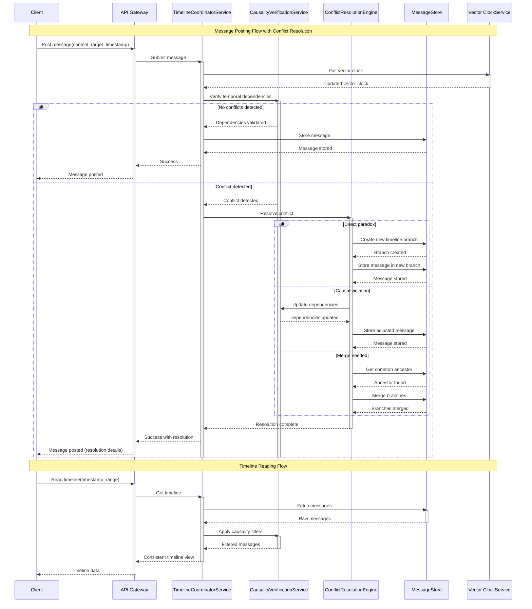

# Time-Travel Social Network System Design

## Problem Statement - Time-Travel Social Network 

Design a distributed system for a social network where:

* Users can post messages that appear in the past or future
* Messages can influence other messages in the timeline
* System must maintain causality despite time-travel elements
* Must handle paradoxes and conflicts

Requirements:

* System Architecture
   * Design data structures to handle temporal relationships
   * Explain conflict resolution mechanisms
   * Detail consistency management approach
   * Describe scaling strategy
* Edge Cases Analysis
   * Identify potential paradoxes
   * Design solutions for circular dependencies
   * Handle message causality violations
   * Manage temporal access control
* Performance Considerations
   * Analyze time complexity of operations
   * Discuss space-time tradeoffs
   * Propose optimization strategies
   * Consider distributed system challenges


## 1. System Architecture

### 1.1 Functional Requirements 

* Users can post messages that appear in the past or future
* Messages can influence other messages in timeline i.e. there are relationships between messages
* System must maintain causality despite time-travel elements 
* Must handle paradoxes and conflicts

### 1.2 Non Functional Requirements
* High Availability - System should be available almost all the time for a good user experience
* Eventual Consistency - Posts can be reflected on the feed after a certain delay due to the presence of temporal relations and distributed nature of the system
* Fault Tolerant - Faults/failures in one or more services should not take down the whole application and the system should be able to deal with such events on its own without being unavailable


### 1.3 Approach and key points

#### Flow

1. Users post messages with timestamps representing the past, present, or future.
2. The message is sent to an orchestrator/proxy service (let's call it Message Coordinator Service). This service will maintain the timeline of messages. When a new message is sent, this service will decide where to place the message in the timeline and also check for causality violations.
3. We would also need a conflict resolution engine to check and manage conflicts if any. 
4. We will then store all messages in a distributed Message Store or Event Store in a log structure, and associate them with temporal metadata. This would provide us a way to reconstruct timelines if required.

#### Timeline Graph
- Directed Acyclic Graph (DAG) structure where the nodes are the Messages and the edges are the causal relationships
- Nodes : Message
- Edges : Causal Dependencies between messages
- Support for multiple timeline branches**
- Each branch maintains its own consistency**


#### Message Model

Messages are connected via a directed acyclic graph (DAG) based on their causal relationships and version data. This DAG structure helps to track dependencies, maintain causality, and avoid circular dependencies.

```json
{
  "message_id": "uuid",
  "author_id": "uuid",
  "content": "string",
  "created_at": "timestamp",           // When message was actually posted
  "target_timestamp": "timestamp",     // Where in timeline message appears
  "dependencies": [             // to handle relationships between messages
    "message_id_1",
    "message_id_2"
  ],
  "version_data": {                    // for causality tracking
    "node_1": 1,
    "node_2": 3
  },
  "state": "enum",                     // VALID, CONFLICTED, RESOLVED
  "alternate_timeline_id": "uuid"      // For handling paradoxes where multiple timelines are created
}
```

### 1.4 Conflict Resolution Mechanisms

If a conflict is detected for a message, the conflict resolution engine can mark messages in either of the following conflicted states -

```python
enum TemporalConflict:
    DIRECT_PARADOX = "direct_paradox"      # Message directly contradicts its own existence
    CAUSAL_VIOLATION = "causal_violation"  # Message breaks causal chain
    MERGE_CONFLICT = "merge_conflict"      # Different timeline branches have conflicting states
    CONCURRENT_EDIT = "concurrent_edit"    # Multiple messages posted to same temporal point
```


### Timeline Branching Pseudo Code

```python
class TimelineBranch:
    def __init__(self, parent_timeline, branch_point, conflict):
        self.id = generate_uuid()
        self.parent_id = parent_timeline.id
        self.branch_point = branch_point
        self.conflict_type = conflict.type
        self.resolution_state = "PENDING"
        self.messages = []
        
    def fork_from_parent(self):
        # Copy messages up to branch point
        messages = self.parent_timeline.get_messages_until(self.branch_point)
        self.messages.extend(messages)
        
    def add_resolution_message(self, message):
        # Add message that triggered branch creation
        self.messages.append(message)
        self.resolution_state = "ACTIVE"
```


### Conflict Resolution Psuedo-Code

```python
class ConflictResolver:
    def resolve_conflict(self, conflict, timeline):
        if conflict.type == TemporalConflict.DIRECT_PARADOX:
            return self._handle_paradox(conflict, timeline)
        elif conflict.type == TemporalConflict.CAUSAL_VIOLATION:
            return self._handle_causal_violation(conflict, timeline)
        elif conflict.type == TemporalConflict.MERGE_CONFLICT:
            return self._handle_merge_conflict(conflict, timeline)
        
    def _handle_paradox(self, conflict, timeline):
        # Create new branch for paradoxical message
        branch = TimelineBranch(
            parent_timeline=timeline,
            branch_point=conflict.message.target_timestamp,
            conflict=conflict
        )
        branch.fork_from_parent()
        branch.add_resolution_message(conflict.message)
        
        # Update original timeline with branch reference
        timeline.add_branch_reference(branch.id)
        
        return branch
    
    def _handle_causal_violation(self, conflict, timeline):
        # Adjust dependent messages
        affected_messages = conflict.affected_messages
        for msg in affected_messages:
            # Update causal dependencies
            msg.update_dependencies()
            # Recompute vector clock
            msg.recompute_vector_clock()
        
        return timeline
    
    def _handle_merge_conflict(self, conflict, timeline):
        # Three-way merge strategy
        base = find_common_ancestor(
            conflict.branch1,
            conflict.branch2
        )
        
        merged_timeline = Timeline()
        merged_timeline.messages = merge_messages(
            base.messages,
            conflict.branch1.messages,
            conflict.branch2.messages
        )
        
        return merged_timeline
```


### 1.5 Consistency Management

Because of the distributed nature of the system, we will aim for Eventual Consistency.

#### Timeline Consistency
1. When posting a message:
   - Generate unique message ID
   - Update vector clock
   - Verify causal dependencies
   - Check for paradoxes
   - If valid, commit to timeline
   - If invalid, trigger conflict resolution

2. When reading timeline:
   - Fetch messages in temporal order
   - Apply causality filters
   - Resolve any conflicts
   - Present consistent view by maintaining snapshots at nodes


#### Vector Clock Implementation
- Each node maintains a vector clock to track message causality
- We will handle concurrent modifications as well

```python
class VectorClock:
    def __init__(self):
        self.timestamps = defaultdict(int)
    
    def increment(self, node_id):
        self.timestamps[node_id] += 1
    
    def merge(self, other_clock):
        # Take maximum of each component
        for node_id, timestamp in other_clock.timestamps.items():
            self.timestamps[node_id] = max(
                self.timestamps[node_id],
                timestamp
            )
    
    def is_concurrent_with(self, other_clock):
        # Check if events are concurrent
        return not (self.happens_before(other_clock) or 
                   other_clock.happens_before(self))
```

### 1.6 Architecture

#### Components
1. **Timeline Coordinator Service**
   - Manages global timeline consistency
   - Handles branch creation and merging

2. **Causality Verification Service**
   - Validates temporal relationships
   - Detects and flags paradoxes
   - Maintains causal dependency graph

3. **Message Store**
   - Distributed message store
   - Supports temporal indexing
   - Handles multiple timeline versions
   - Cassandra will the best option in terms of scalability

4. **Conflict Resolution Engine**
   - Implements paradox resolution strategies
   - Manages timeline branching
   - Applies reconciliation rules if required

5. **Vector Clock Service**
   - For consistency management in timelines
   - Acts as a source of truth for time



### 1.7 Scaling Strategy

#### Horizontal Scaling
- We will use a message queue (e.g. Kafka) to notify nodes of new messages or causality changes. Using Kafka will also provide us retry mechanisms and persitence at queue level.
- We can use sharding based on time periods (temporal) and partition by timeline branches. This would ensure better resource utilization and reduce latency.
- We can also replicate frequently accessed periods across shards.
- We can cache recent timeline segments or predicted future events for even more reduction in latency for the end user.

#### Read/Write Replica
- Read replicas for popular time periods 
- Write consolidation for conflict resolution
- Async propagation of timeline updates using Message Queues (Kafka)
- Local caching of stable timeline segments for faster access

### 2.1 Edge Case Analysis

* If a message influences its own cause (paradox), we can chose any of the following options - 
   1. Split into multiple timelines with their own unique identifier (uuid).
      a. Each timeline/branch can maintain its own consistent history.
      b. Changes in one timeline will only affect that timeline, keeping other timeline unaffected.
   2. We can also give the user the option to view all timelines and select the main timeline to be followed.
* If two messages contradict each other within the same timeline, we can -
   a. Give priority on the basis of sequence of events (temporal priority)
   b. Assign influence scores to messages and prioritize message with more influence on other messages.
   ```python
      def resolve_by_priority(conflicting_messages):
         return max(
            conflicting_messages,
            key=lambda m: calculate_message_priority(m)
         )

      def calculate_message_priority(message):
         return (
            # We can use a custom way of calculating priority based on different parameters
         )
   ```
* There can be a case where timelines can converge. In such case, we can merge timelines based on user choices or we can merge the conflicting events based on temporal priority.

* **Message Causality Violations:** If message B appears before message A (which influenced B), a causality violation occurs.
Solution: Delay visibility of B until A is published or adjusted in the timeline. The visibility should work like Topological Sorting in a graph and the dependent elements should only be shown if their parents are shown already.

### 2.2 Paradox Types and how to handle

1. Message attempts to prevent its own creation
   - Solution: Create alternate timeline branch and mark original message as resolved

2. Cycle in messages
   - Solution:Tag messages causal metadata

3. Conflicting alternate histories of timeline
   - Solution: Version reconciliation and timeline branch merging when possible


### 2.3 Access Control

How will we prevent users for seeing messages that they should not see?

- Temporal access control based on a user's present time
- Branch-specific permissions for users
- Paradox resolution privileges and merging access control can also be implemented.
- We should prevent users from viewing paradoxical messages from the future. Hence, we have to show resolved messages only.

## 3. Performance Optimization

### 3.1 Time Complexity Analysis

Suppose n is the number of messages

- Post a Message: O(log n) average case (Adding a node to a graph and updating timeline)
- Read a timeline : O(k log n) where k is window size (This will work like DFS in a graph)
- Paradox detection: O(p) where p is dependency count
- Branch creation: O(m) where m is the number of copied messages

### 3.2 Optimization Strategies

- Storing full temporal/causal paths can consume space but fastens the conflict checks.
- Temporal caching takes more space but provides faster access to high-demand time intervals.

1. **Caching**
   - Cache stable timeline segments
   - Pre-compute common views
   - Cache paradox resolution results for future cases
   - Maintain causality graphs in memory for faster retrieval

2. **Indexing**
   - Temporal indexes for quick lookup based on creation-time and targe time
   - Branch navigation indexes to jump between timelines

3. **Batch Processing**
   - Bulk message insertion
   - Async paradox detection for near realtime experience
   - Background timeline merging for better user experience

4. **Branch Trimming**
   - Regularly trim irrelevant or low-impact causal relationships to reduce causal relationships

### 3.3 Storage Optimization

- Time-based partitioning of data
- Cold storage for old segments as they will not be accessed as frequently
- Compression for inactive branches or using data lake
- Metadata separation from content (we can use NoSQL DB for metadata)

## 3.4 Implementation Considerations

### 3.4.1 Technology Stack

- Distributed database: Apache Cassandra
- Message queue: Apache Kafka
- Caching: Redis
- API: GraphQL for flexible queries

### 3.4.2 Monitoring and Maintenance

These are some of the parameters we can monitor for performance -

- Paradox detection rates
- Branch creation frequency
- Conflict resolution success rate
- Causality violation rate

### 3.4.3 Failure Handling

- Partition tolerance
   Solution : Replication of data and load balancing
- Ability to reconstruct timeline 
   Solution : Using the data associated to a timeline in message store for reconstruction

## 3.5 Distributed System Challenges
* Data Consistency: Achieving causal consistency across nodes is complex; vector clocks and DAG checks help maintain a stable causality order.
* Latency Management: Users posting in the “future” could lead to high-latency reordering of messages; temporal caching and sharding reduce load.
